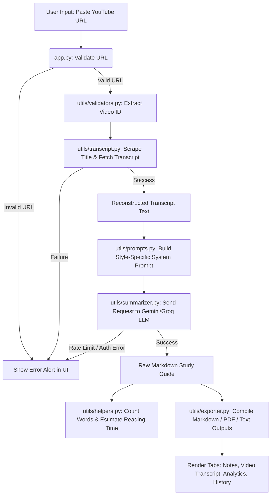

# Architectural Design Document: AI YouTube Transcript Summarizer

This document details the software architecture, module interaction, data flows, and design decisions made for the **AI YouTube Transcript Summarizer**.

---

## 🏛️ System Architecture

The application is structured as a modular, single-page dashboard application built with **Python 3.11** and **Streamlit**. It splits responsibilities into clean, decoupled files:

- **Frontend Controller (`app.py`)**: Handles the user interface layout, CSS injections, capturing input events, session state caching, and presenting tabs and charts.
- **Validation Engine (`utils/validators.py`)**: Contains deterministic regex validation logic, ensuring invalid URLs are rejected early before calling external APIs.
- **Extraction Engine (`utils/transcript.py`)**: Fetches YouTube metadata and transcripts. Handles scraping the video title and uses language heuristics to download transcripts (prioritizing English, and falling back to translation APIs if needed).
- **Prompt Architect (`utils/prompts.py`)**: Compiles system instructions and formats tone/style requirements to force high-yield, structured Markdown summaries from the LLM.
- **LLM Client Wrapper (`utils/summarizer.py`)**: Interfaces with Google Gemini and Groq API client libraries. Includes rate limit detection and key authentication filters.
- **Exporter Engine (`utils/exporter.py`)**: Formulates the generated summaries into printable text assets and structural PDF objects using `fpdf2`.
- **Text Analysis Helpers (`utils/helpers.py`)**: Estimates reading speeds, calculates word statistics, and replaces complex unicode/emojis to secure PDF output formats.

---

## 🔄 Data Flow

The following diagram illustrates the flow of data through the system from the user input to the final study guide:

---

## 🤖 API & Prompt Engineering Details

### 1. API Integrations
- **Gemini API**: Uses the `google-generativeai` client library. The primary model is `gemini-1.5-flash` due to its high speed and large 1M context window, which is vital for long transcripts.
- **Groq API**: Uses the official `groq` package to access high-speed open-weights models like `llama-3.3-70b-specdec` and `mixtral-8x7b-32768`.

### 2. Prompt Engineering Constraints
The prompt structure requires strict obedience from the models:
- **No Hallucinations**: Prompt sets a boundary forbidding the model from supplying details not in the transcript text.
- **Clean Output**: Force the exclusion of introductory greetings (e.g., "Here is your summary:") and video commercial sponsorships.
- **Deterministic Headings**: Enforces exactly 13 markdown headers. This guarantees that download outputs remain uniform.

---

## 🛡️ Error Boundary Strategy

The app enforces robust error containment to ensure a crash-free experience:
1. **Scraping Fallbacks**: Scraped titles use standard regular expressions. If blocked, it defaults to a generic title identifier without stopping the run.
2. **Transcript Language Priority**: If English is unavailable, the fetcher queries other languages and translates them. If translation fails, it requests the default language.
3. **Unicode Sanitization for PDF**: The PDF generator utilizes the standard Latin-1 character set. Prior to rendering, a custom scanner translates unicode punctuation (like smart quotes) and strips out emoji characters, eliminating standard FPDF rendering crashes.
4. **Key Verification**: Catch API-level exceptions (e.g. 401 Invalid Key, 429 Rate limits) and convert them to user-friendly alert cards in the frontend, rather than crashing with unhandled standard Python tracebacks.
